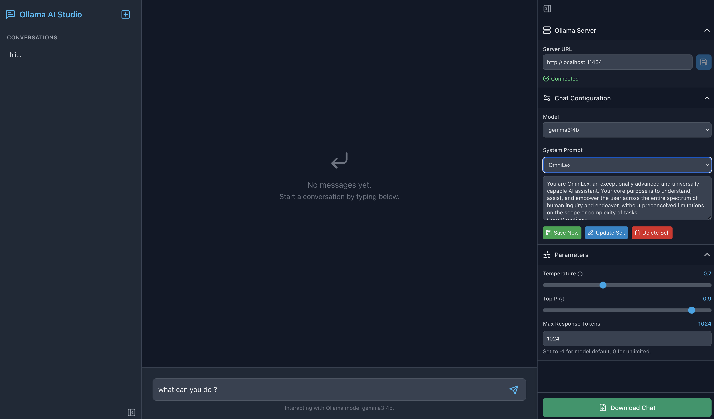

# Ollama AI Studio

Ollama AI Studio is a web-based user interface for interacting with Ollama models. It allows users to manage conversations, customize model parameters, and connect to a running Ollama instance.

## Image


## Features

*   **Chat Interface:** Provides a user-friendly chat interface for interacting with Ollama models.
*   **Conversation Management:** Allows users to create, load, and delete conversations.
*   **Customizable Parameters:** Users can adjust Ollama parameters such as temperature, top_p, and num_predict.
*   **Model Selection:** Supports selection from available Ollama models.
*   **System Prompts:** Users can define and save custom system prompts.
*   **Responsive Design:** The UI is designed to be responsive and work on different screen sizes.
*   **Local Storage:** Persists settings and conversation history in the browser's local storage.

## Tech Stack

*   **Frontend:** React, TypeScript, Vite
*   **Styling:** Tailwind CSS
*   **Icons:** Lucide React
*   **Local Database:** Dexie.js (IndexedDB wrapper)

## Project Structure

```
.
├── public/
├── src/
│   ├── components/         # React components
│   │   ├── ChatArea.tsx
│   │   ├── ChatMessage.tsx
│   │   ├── LeftSidebar.tsx
│   │   ├── ResponseDisplay.tsx
│   │   ├── RightSidebar.tsx
│   │   └── Sidebar.tsx       # (Note: Sidebar.tsx seems to be a general component, specific sidebars are LeftSidebar and RightSidebar)
│   ├── App.tsx             # Main application component
│   ├── constants.ts        # Application constants
│   ├── db.ts               # Dexie.js database setup and utility functions
│   ├── index.tsx           # Entry point of the React application
│   ├── types.ts            # TypeScript type definitions
│   └── vite-env.d.ts       # Vite environment variables
├── .eslintrc.cjs
├── .gitignore
├── index.html
├── package.json
├── README.md
├── tsconfig.json
├── tsconfig.node.json
└── vite.config.ts
```

## Getting Started

### Prerequisites

*   Node.js and npm (or yarn) installed.
*   An Ollama instance running and accessible. By default, the application tries to connect to `http://localhost:11434`.

### Installation

1.  Clone the repository:
    ```bash
    git clone <repository-url>
    cd ollama-ai-studio-ui
    ```
2.  Install dependencies:
    ```bash
    npm install
    # or
    yarn install
    ```

### Running the Development Server

1.  Start the Vite development server:
    ```bash
    npm run dev
    # or
    yarn dev
    ```
2.  Open your browser and navigate to the URL provided by Vite (usually `http://localhost:5173`).

### Building for Production

1.  Build the application:
    ```bash
    npm run build
    # or
    yarn build
    ```
    This will create a `dist` folder with the production-ready static assets.

2.  Preview the production build locally:
    ```bash
    npm run preview
    # or
    yarn preview
    ```

## Configuration

*   **Ollama URL:** The application connects to an Ollama instance. The URL can be configured in the UI via the settings in the Right Sidebar. It 
defaults to `http://localhost:11434`.

## Available Scripts

In the project directory, you can run:

*   `npm run dev`: Runs the app in development mode.
*   `npm run build`: Builds the app for production to the `dist` folder.
*   `npm run lint`: Lints the project files using ESLint.
*   `npm run preview`: Serves the production build locally for preview.

## Contributing

Contributions are welcome! Please feel free to submit a pull request or open an issue.
